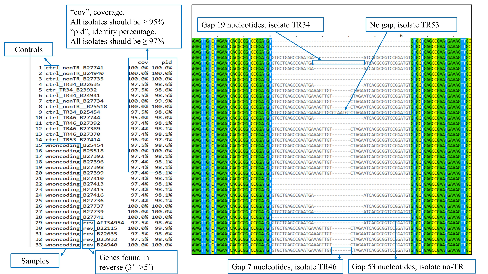
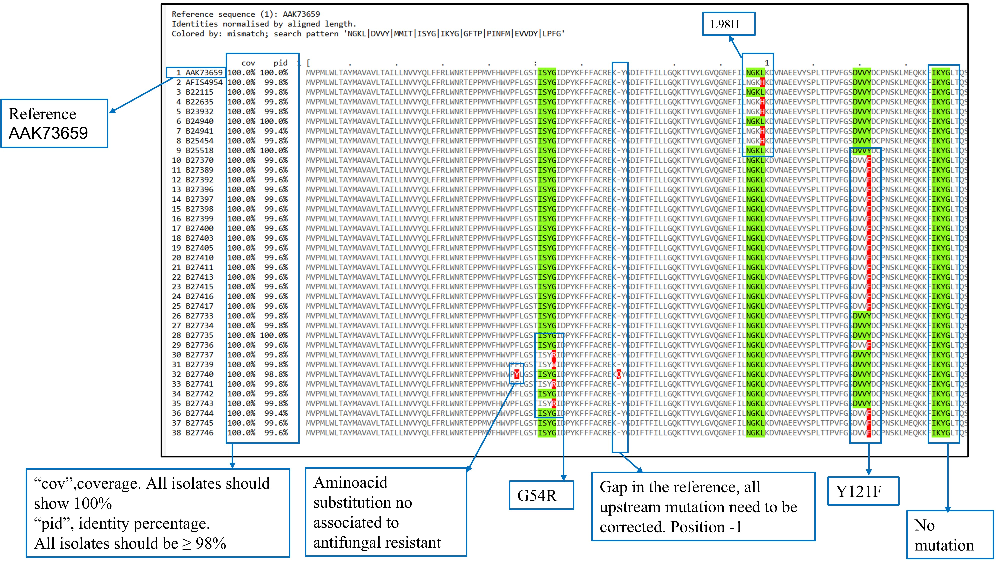
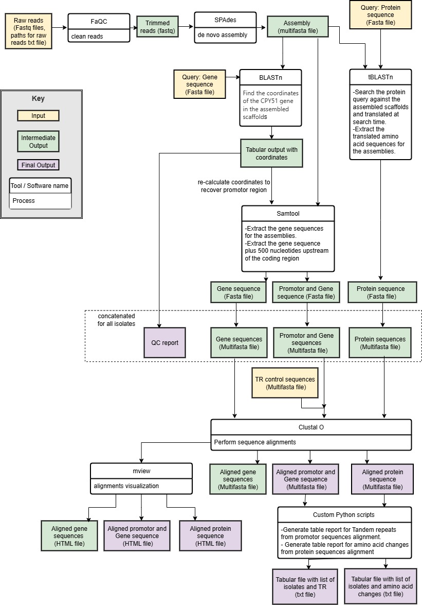

# MycoGene: A workflow for extracting specific gene sequences from WGS Illumina paired-end short reads

# Description

MycoGene_Afum_CPY51 is a workflow for determining the DNA sequence of the CYP51A gene in Aspergillus fumigatus. This pipeline is suitable for determining whether the CYP51A promoter region and coding sequence contain mutations, tandem repeats (Ex. TR34, TR46) and aminoacid changes (Ex.L98H, Y121F) that confer resistance to the triazole antifungal drugs. 

This workflow performs quality controls, generates de novo assemblies, and extracts target gene sequences. The FASTA output files are compatible with various downstream analytical tools for build phylogenetic trees and visualize alignments.

## Input:
1. `samples-paths.txt`, Plain text file that contains the samples name and paths for raw reads, separated by `:`. One sample per row, no header.  
Example:
   ```
   Sample1:/my-path/sample1_R1.fastq.gz:/my-path/sample1_R2.fastq.gz  
   Sample2:/my-path/sample2_R1.fastq.gz:/my-path/sample2_R2.fastq.gz
   ```
## Preloaded inputs:
2. `query_seq.fasta`, Fasta file that contains nucleotide sequence of the gene CYP51 (AF338659).
3. `query_aa.fasta` , Fasta file that contains aminoacid sequence of the protein CYP51 (AAK73659).
4. `ctrl_TR`, Fasta file that contains nucleotide sequences of the gene CYP51 and 500 nucleotides upstream to include the promotor region, for the control sequences.
5. `query_long_TR53`, Fasta file that contains nucleotide sequences of the gene CYP51 and 500 nucleotides upstream to include the promotor region for one isolate (B27414) positive for TR53


## Outputs:

1. `aln_gene_output.fasta`, Fasta file that contains aligned nucleotide sequence of the gene of interest for all samples.
2. `aln_protein_output.fasta`, Fasta file that contains aligned aminoacid sequence of the protein of interest for all samples.
3. `aln_wnoncoding_gene_output.fasta`, Fasta file that contains aligned nucleotide sequence of the gene of interest plus a 500 nucleotides upstream of the coding gene for all samples.Upstream region include the gene promotor for identifing the tandem repeats (TR34, TR46)
1. `QC_report.txt`, Tabular text file with blastn hits information.
<br/><br/>
**Note**: Review QC report for the following quality metrics:

   | QC Metric                       | Threshold                           |
   | ------------------------------- |-------------------------------------|
   | Percentage of identity (pident) | > 95 %                              |
   | Length                          | Similar to the query sequence length|
2. `Tandem_repeats_results_from_aln.txt`, Tabular file, the first column list all isolates ID, second column report the length of the gap in the promotor region related to the presence or not of Tandem repeats. The third column report the TR. The TR here is defined based on the gap length from an alignment of all included isolates and a set of controls with known TR, therefore this report can be affected by misaligned sequences if a sample that is not A. fumigatus or a sample with low QC metric are included
3. `TR_results.txt`, Tabular file, the first column list the sequence name for each isolate and second column report the TR. The TR here is defined based on a Blastn alignment between each sample sequence and the longest sequence recovered from a control isolates with TR53 as a query. This output is redundant with “Tandem_repeats_results_from_aln.txt” but because the here the TR determination is based in pairwise alignment is not affected by the context of all isolates.
4. `mismatch_results.txt`, Tabular file, the first column list isolates ID, second column report the aminoacid change, please notice that the same sample can have more than one aminoacid change, each row represent a position so the same isolates id can be listed several times.

### Aditional Outputs
5. `aln_protein_output.fasta`, Fasta file that contains aligned amino acid sequence of the protein CYP51 for all samples.
6.	`aln_wnoncoding_gene_output.fasta`, Fasta file that contains aligned nucleotide sequence of the CPY51 gene  plus a 500 nucleotides upstream of the coding region, for all samples including positive controls for tandem repeats. Upstream regions include the gene promotor for identifying the tandem repeats (TR34, TR46, TR53)
7. `data2_protein_aln.html`, visualization of the aligned aminoacid sequence
8.	`data_upstream-CPY51_aln.html`, visualization of the aligned nucleotide sequence of the CPY51 gene  plus a 500 nucleotides upstream.



## Requirements
- FaQCs (https://github.com/LANL-Bioinformatics/FaQCs)
- SPAdes (https://github.com/ablab/spades)  
- blast (https://www.ncbi.nlm.nih.gov/books/NBK569861/)  
- samtools (https://bioconda.github.io/recipes/samtools/README.html)    
- Clustal omega (https://github.com/GSLBiotech/clustal-omega)  
- mView (https://sourceforge.net/projects/bio-mview/files/bio-mview)
- Biophyton
  
## Running MycoGene
1. Ensure your inputs are placed in the same directory as the ` MycoGene_blastn_v1.1.sh` and ` Mycogene_multiquery_v2.sh` scripts.
2. `nohup bash  Mycogene_multiquery_v2.sh`

# Workflow


# Citations
If you use MycoGene in your work, please consider this citing repository https://github.com/CDCgov/MycoGene

# CDCgov GitHub Organization Open Source Project

**General disclaimer** This repository was created for use by CDC programs to collaborate on public health related projects in support of the [CDC mission](https://www.cdc.gov/about/organization/mission.htm).  GitHub is not hosted by the CDC, but is a third party website used by CDC and its partners to share information and collaborate on software. CDC use of GitHub does not imply an endorsement of any one particular service, product, or enterprise. 

## Access Request, Repo Creation Request

* [CDC GitHub Open Project Request Form](https://forms.office.com/Pages/ResponsePage.aspx?id=aQjnnNtg_USr6NJ2cHf8j44WSiOI6uNOvdWse4I-C2NUNk43NzMwODJTRzA4NFpCUk1RRU83RTFNVi4u) _[Requires a CDC Office365 login, if you do not have a CDC Office365 please ask a friend who does to submit the request on your behalf. If you're looking for access to the CDCEnt private organization, please use the [GitHub Enterprise Cloud Access Request form](https://forms.office.com/Pages/ResponsePage.aspx?id=aQjnnNtg_USr6NJ2cHf8j44WSiOI6uNOvdWse4I-C2NUQjVJVDlKS1c0SlhQSUxLNVBaOEZCNUczVS4u).]_

## Related documents

* [Open Practices](open_practices.md)
* [Rules of Behavior](rules_of_behavior.md)
* [Thanks and Acknowledgements](thanks.md)
* [Disclaimer](DISCLAIMER.md)
* [Contribution Notice](CONTRIBUTING.md)
* [Code of Conduct](code-of-conduct.md)

## Overview

Describe the purpose of your project. Add additional sections as necessary to help collaborators and potential collaborators understand and use your project.
  
## Public Domain Standard Notice
This repository constitutes a work of the United States Government and is not
subject to domestic copyright protection under 17 USC § 105. This repository is in
the public domain within the United States, and copyright and related rights in
the work worldwide are waived through the [CC0 1.0 Universal public domain dedication](https://creativecommons.org/publicdomain/zero/1.0/).
All contributions to this repository will be released under the CC0 dedication. By
submitting a pull request you are agreeing to comply with this waiver of
copyright interest.

## License Standard Notice
The repository utilizes code licensed under the terms of the Apache Software
License and therefore is licensed under ASL v2 or later.

This source code in this repository is free: you can redistribute it and/or modify it under
the terms of the Apache Software License version 2, or (at your option) any
later version.

This source code in this repository is distributed in the hope that it will be useful, but WITHOUT ANY
WARRANTY; without even the implied warranty of MERCHANTABILITY or FITNESS FOR A
PARTICULAR PURPOSE. See the Apache Software License for more details.

You should have received a copy of the Apache Software License along with this
program. If not, see http://www.apache.org/licenses/LICENSE-2.0.html

The source code forked from other open source projects will inherit its license.

## Privacy Standard Notice
This repository contains only non-sensitive, publicly available data and
information. All material and community participation is covered by the
[Disclaimer](DISCLAIMER.md)
and [Code of Conduct](code-of-conduct.md).
For more information about CDC's privacy policy, please visit [http://www.cdc.gov/other/privacy.html](https://www.cdc.gov/other/privacy.html).

## Contributing Standard Notice
Anyone is encouraged to contribute to the repository by [forking](https://help.github.com/articles/fork-a-repo)
and submitting a pull request. (If you are new to GitHub, you might start with a
[basic tutorial](https://help.github.com/articles/set-up-git).) By contributing
to this project, you grant a world-wide, royalty-free, perpetual, irrevocable,
non-exclusive, transferable license to all users under the terms of the
[Apache Software License v2](http://www.apache.org/licenses/LICENSE-2.0.html) or
later.

All comments, messages, pull requests, and other submissions received through
CDC including this GitHub page may be subject to applicable federal law, including but not limited to the Federal Records Act, and may be archived. Learn more at [http://www.cdc.gov/other/privacy.html](http://www.cdc.gov/other/privacy.html).

## Records Management Standard Notice
This repository is not a source of government records, but is a copy to increase
collaboration and collaborative potential. All government records will be
published through the [CDC web site](http://www.cdc.gov).

## Additional Standard Notices
Please refer to [CDC's Template Repository](https://github.com/CDCgov/template) for more information about [contributing to this repository](https://github.com/CDCgov/template/blob/main/CONTRIBUTING.md), [public domain notices and disclaimers](https://github.com/CDCgov/template/blob/main/DISCLAIMER.md), and [code of conduct](https://github.com/CDCgov/template/blob/main/code-of-conduct.md).

## SHARE IT Act Metadata
* Organization: NCEZID/DFWED/MDB
* Contact Email: ncezid_shareit@cdc.gov

